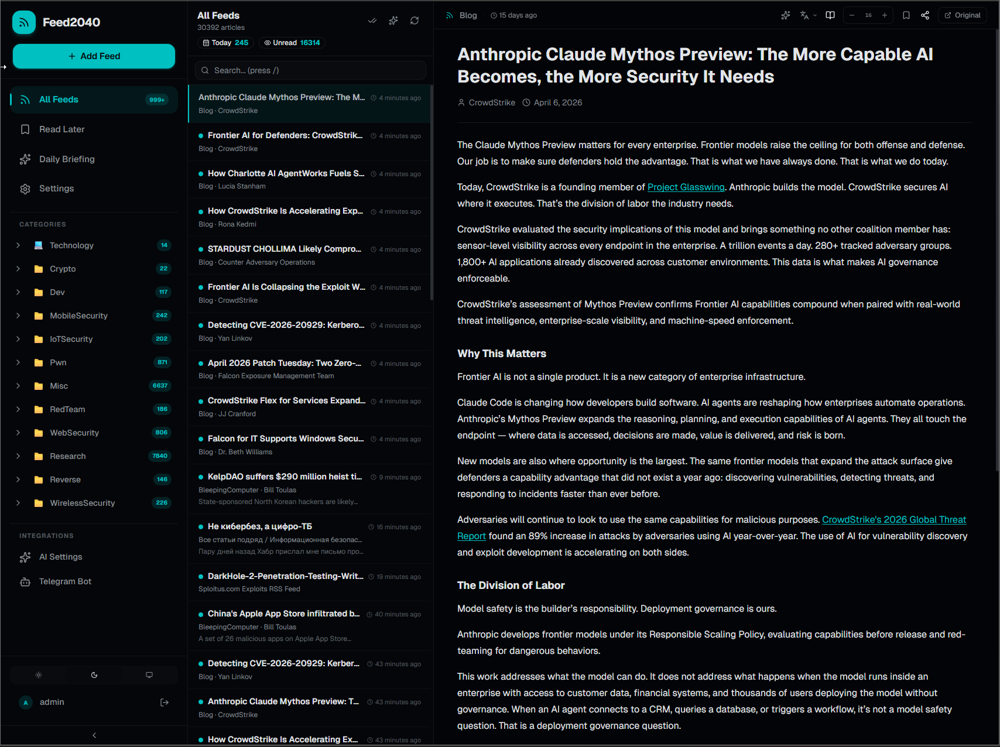
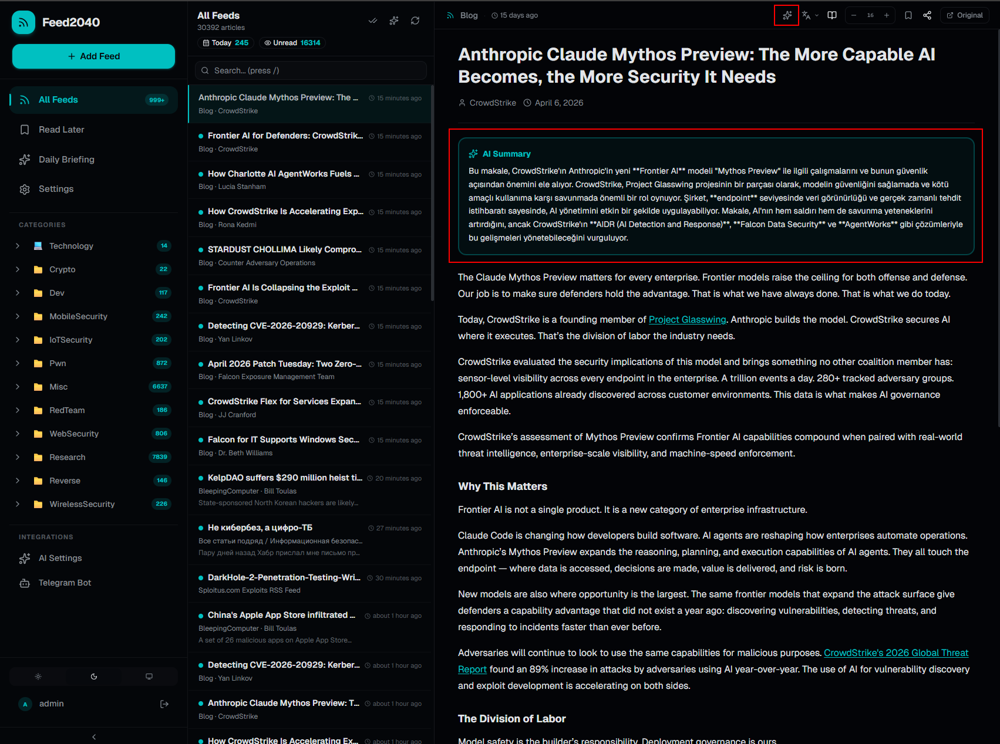
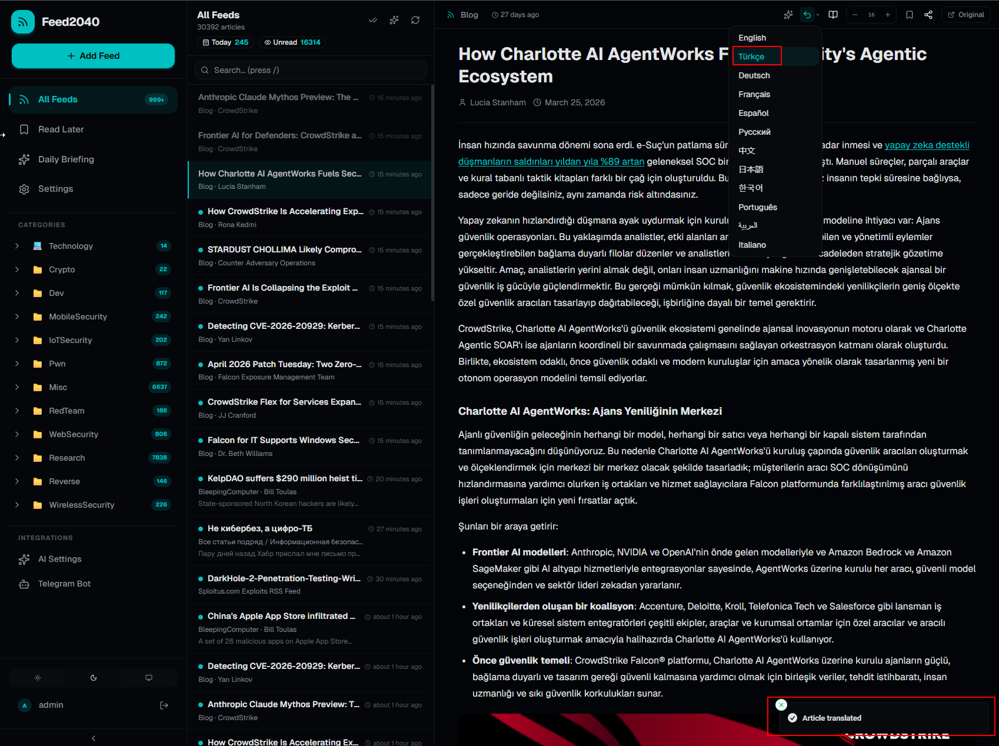
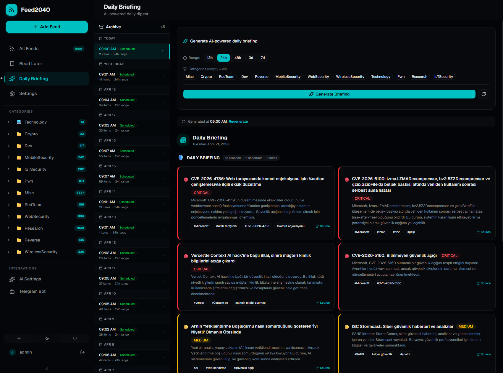
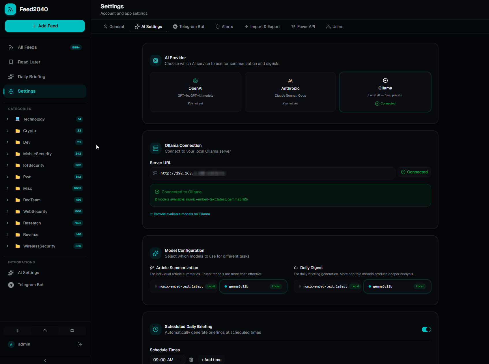

<p align="center">
  
  
  
  
  
</p>

# Feed2040

**A self-hosted, AI-powered RSS reader with daily briefings, Telegram integration, and a modern three-panel interface.**

Feed2040 aggregates your RSS feeds, uses AI to summarize and prioritize articles, generates daily briefings, and delivers them to your Telegram — all running on your own server.

---

## Features

- **Three-Panel Reader** — Sidebar, article list, and reading pane. Click an article on the left, read it on the right. Just like email.
- **AI Summarization** — Summarize any article with one click. Supports OpenAI, Anthropic, and local Ollama models.
- **Daily Briefings** — Scheduled AI-generated digests that score articles by global importance, remove duplicates, and deliver a concise briefing.
- **Telegram Bot** — Get briefings and keyword-based notifications delivered directly to Telegram.
- **OPML Import/Export** — Migrate from any RSS reader. Import hundreds of feeds at once.
- **Categories & Filters** — Organize feeds into categories. Filter briefings by topic.
- **Bookmarks** — Save articles for later reading.
- **Keyboard Shortcuts** — Navigate with `j`/`k`, open with `o`, bookmark with `b`.
- **Dark Theme** — Modern dark UI built with shadcn/ui and Tailwind CSS.
- **Multi-User** — Each user manages their own API keys, feeds, and Telegram bot independently.
- **Self-Hosted** — Your data stays on your server. Deploy with a single `docker compose up`.

---

## Screenshots

### Three-Panel Feed Reader


### AI Summary & Reading


### Article Translation


### AI-Powered Daily Briefing


### AI Provider Settings


---

## Quick Start

### Prerequisites

- **Docker** and **Docker Compose** (v2+)
- 1 GB RAM minimum (2 GB recommended if using local AI)
- *(Optional)* Ollama for local AI summarization

### 1. Clone the repository

```bash
git clone https://github.com/0xhav0c/Feed2040.git
cd Feed2040
```

### 2. Configure environment

```bash
cp .env.example .env
```

Edit `.env` and set the required secrets:

```bash
# Generate required secrets
openssl rand -base64 32   # → NEXTAUTH_SECRET
openssl rand -hex 24      # → CRON_SECRET
```

### 3. Start the application

```bash
docker compose up -d
```

That's it. Open [http://localhost:3000](http://localhost:3000) and create your account.

---

## Configuration

### Environment Variables

| Variable | Default | Description |
|----------|---------|-------------|
| `POSTGRES_USER` | `feed2040` | PostgreSQL username |
| `POSTGRES_PASSWORD` | `feed2040` | PostgreSQL password |
| `POSTGRES_DB` | `feed2040` | Database name |
| `APP_PORT` | `3000` | Application port |
| `NEXTAUTH_URL` | `http://localhost:3000` | Full application URL |
| `NEXTAUTH_SECRET` | — | **Required.** Generate with `openssl rand -base64 32` |
| `REFRESH_INTERVAL_MINUTES` | `15` | How often feeds are refreshed |
| `CRON_SECRET` | — | **Required.** Generate with `openssl rand -hex 24` |
| `ENCRYPTION_SALT` | — | Optional. Custom salt for API key encryption |

### Optional Services

Each user configures their own API keys through the **Settings UI** after login. Alternatively, instance-wide defaults can be set via environment variables:

| Variable | Description |
|----------|-------------|
| `OPENAI_API_KEY` | OpenAI API key (instance-wide fallback) |
| `ANTHROPIC_API_KEY` | Anthropic API key (instance-wide fallback) |
| `TELEGRAM_BOT_TOKEN` | Telegram bot token (instance-wide fallback) |

> **Multi-user:** Each user can set their own API keys in Settings. Per-user keys take priority over instance-wide defaults.

---

## AI Providers

Feed2040 supports multiple AI backends. Configure via **Settings → AI Provider**:

| Provider | Best For | Cost |
|----------|----------|------|
| **Ollama** (local) | Privacy, no API costs | Free (requires GPU/CPU) |
| **OpenAI** | High quality summaries | Pay per token |
| **Anthropic** | Long-form analysis | Pay per token |

### Using Ollama (Local AI)

1. Install [Ollama](https://ollama.ai)
2. Pull a model: `ollama pull gemma3:12b`
3. In Settings, select "Ollama" and enter your Ollama URL

> **Docker users:** Use `http://host.docker.internal:11434` or your host IP as the Ollama URL.

---

## Telegram Integration

1. Create a bot via [@BotFather](https://t.me/BotFather) on Telegram
2. Go to **Settings → Telegram** and enter your bot token
3. Send `/start` to your bot
4. Configure notification rules and briefing schedules

### Telegram Features

- Receive daily briefings at scheduled times
- Get notifications for articles matching keywords
- Customizable notification rules per category

---

## Architecture

```
┌────────────────────────────────────────────────┐
│                  Docker Compose                 │
├──────────┬──────────────┬──────────────────────┤
│ PostgreSQL│    Redis     │    Next.js App       │
│   :5432   │    :6379     │      :3000           │
│           │              │                      │
│  Articles │  Cache       │  ┌─ App Router       │
│  Feeds    │  Sessions    │  ├─ API Routes       │
│  Users    │              │  ├─ Cron Worker       │
│  Digests  │              │  └─ Telegram Poller   │
└──────────┴──────────────┴──────────────────────┘
                                    │
                          ┌─────────┼─────────┐
                          ▼         ▼         ▼
                       Ollama   OpenAI   Anthropic
                       (local)  (cloud)   (cloud)
```

### Tech Stack

- **Framework:** Next.js 16 (App Router, React 19)
- **Database:** PostgreSQL 16 + Prisma ORM
- **Cache:** Redis 7
- **UI:** shadcn/ui, Tailwind CSS, GSAP animations
- **Auth:** NextAuth.js (credentials)
- **AI:** OpenAI, Anthropic, Ollama
- **Notifications:** Telegraf (Telegram Bot API)

---

## Development

### Local Setup (without Docker)

```bash
# Install dependencies
npm install

# Set up database
npx prisma generate
npx prisma db push

# Start dev server
npm run dev
```

### Available Commands

| Command | Description |
|---------|-------------|
| `npm run dev` | Start development server with hot reload |
| `npm run build` | Create production build |
| `npm run start` | Start production server |
| `npm run lint` | Run ESLint |

### Project Structure

```
src/
├── app/
│   ├── (auth)/          # Login, register, setup pages
│   ├── (dashboard)/     # Main app pages
│   │   ├── feeds/       # Three-panel RSS reader
│   │   ├── briefing/    # Daily briefing with history
│   │   ├── bookmarks/   # Saved articles
│   │   ├── categories/  # Category management
│   │   └── settings/    # App configuration
│   └── api/             # API routes
├── components/
│   ├── feed/            # Article cards, reading panel
│   ├── layout/          # Sidebar, header
│   └── ui/              # shadcn/ui components
├── lib/
│   ├── ai/              # AI provider abstraction
│   ├── telegram/        # Bot, digest builder
│   └── hooks/           # Custom React hooks
└── types/               # TypeScript definitions
```

---

## Updating

```bash
git pull
docker compose build --no-cache app
docker compose up -d app
```

Database migrations run automatically on container start.

---

## System Requirements

| Component | Minimum | Recommended |
|-----------|---------|-------------|
| **RAM** | 1 GB | 2 GB (4 GB with Ollama) |
| **CPU** | 1 core | 2+ cores |
| **Disk** | 1 GB | 10 GB+ (depends on feed count) |
| **Docker** | 20.10+ | Latest |
| **Docker Compose** | v2.0+ | Latest |

---

## Contributing

Contributions are welcome. Please open an issue first to discuss what you'd like to change.

1. Fork the repository
2. Create your feature branch (`git checkout -b feature/amazing-feature`)
3. Commit your changes (`git commit -m 'Add amazing feature'`)
4. Push to the branch (`git push origin feature/amazing-feature`)
5. Open a Pull Request

---

## License

This project is licensed under the MIT License. See [LICENSE](LICENSE) for details.

---

<p align="center">
  Built with ☕ and RSS feeds.
</p>
